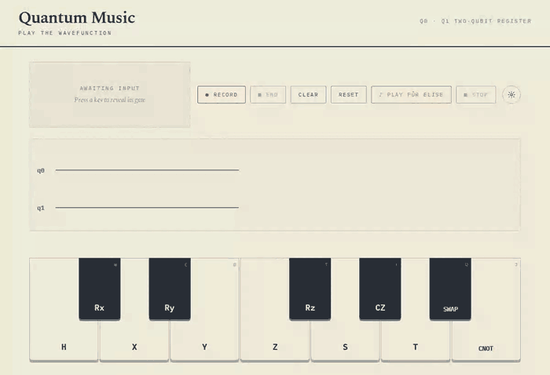

# QuantumMusic

[](LICENSE)

[](https://react.dev/)

A playable piano keyboard, one octave, where each of the twelve keys is bound to a quantum gate
instead of just a note.

**[▶ Try it live](https://otisranson.github.io/QuantumMusic/)** — runs entirely client-side
(React + Web Audio API, no backend), so the GitHub Pages deploy is the real thing, not a demo.
The GIF below is a preview for anyone who can't click through.



> Split out of [otisranson/QuantumResearch](https://github.com/otisranson/QuantumResearch) with
> full git history, once it outgrew that repo's proof-of-concept scope.

## What it does

Press a key and two things happen at once: an audible sine-wave tone plays (standard C4–B4 piano
frequencies via the Web Audio API), and its gate shows up on a live circuit diagram over a
two-qubit register, `q0` and `q1`. White keys carry the classic gate set — `H X Y Z S T CNOT`;
black keys carry rotations and a second entangling pair — `Rx Ry Rz CZ SWAP`. Single-qubit gates
land on `q0` (except `Rz`, which targets `q1`, so both wires get some traffic), and
`CNOT` / `CZ` / `SWAP` span both.

There are two modes. **Freeplay** is instant gratification — every keypress plays its tone and
pops up an info card for that one gate (symbol, name, description, target qubit), with nothing
accumulating. **Record** turns the piano into a composer: press Record, and every key you play is
both heard and appended to the circuit diagram, gate after gate in standard circuit notation
(control dots, `⊕` targets, `×` swaps) rendered live in SVG; press End to lock the finished
circuit in place. A gear-icon Settings panel lets you remap any of the twelve keys to any keyboard
key, in case the default `A S D F G H J` / `W E T Y U` layout doesn't fit your hands.

**♪ Play Für Elise** turns the piano into a music box: a hardcoded, ~20-second excerpt of the
opening theme from Beethoven's "Für Elise" (public domain) plays itself back through the exact
same Record pipeline a human would use — keys highlight and sound in sequence, gates land on the
circuit diagram, and the diagram auto-scrolls to keep the newest one in view. Since the keyboard
is a single fixed octave, every note collapses to its pitch class regardless of which octave it's
actually in in the real piece, which is why the melody sounds *slightly* off despite being
faithful note-for-note — an inherent trade-off of mapping a whole piece onto twelve gates rather
than a limitation of the transcription itself. Manual keyboard/mouse input is disabled while it
plays; ■ Stop cancels partway through and hands control back.

No backend, no external UI libraries — just React, Tailwind, and the Web Audio API.

## Running locally

```bash
npm install
npm run dev
```

Then open the URL Vite prints (typically http://localhost:5173) and start playing — either by
clicking keys or by typing on the keyboard mapping shown in the corner of each key.

## Linting

```bash
npm run lint
```

`.github/workflows/lint.yml` runs this on every push and pull request.

## Deploying

`.github/workflows/deploy-pages.yml` builds the app with `--base=/QuantumMusic/` and publishes it
to GitHub Pages on every push to `main`.
